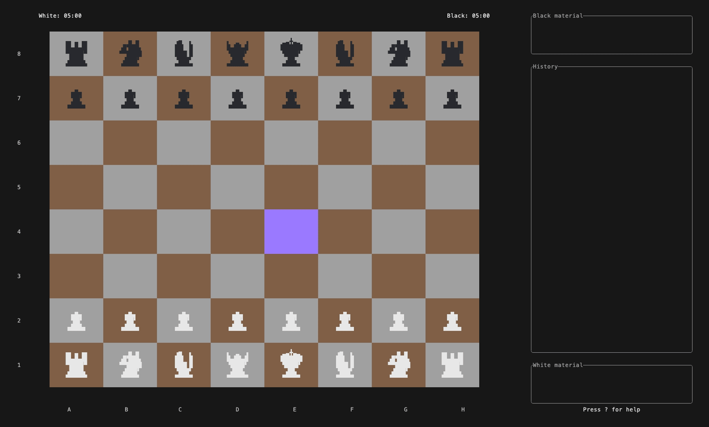
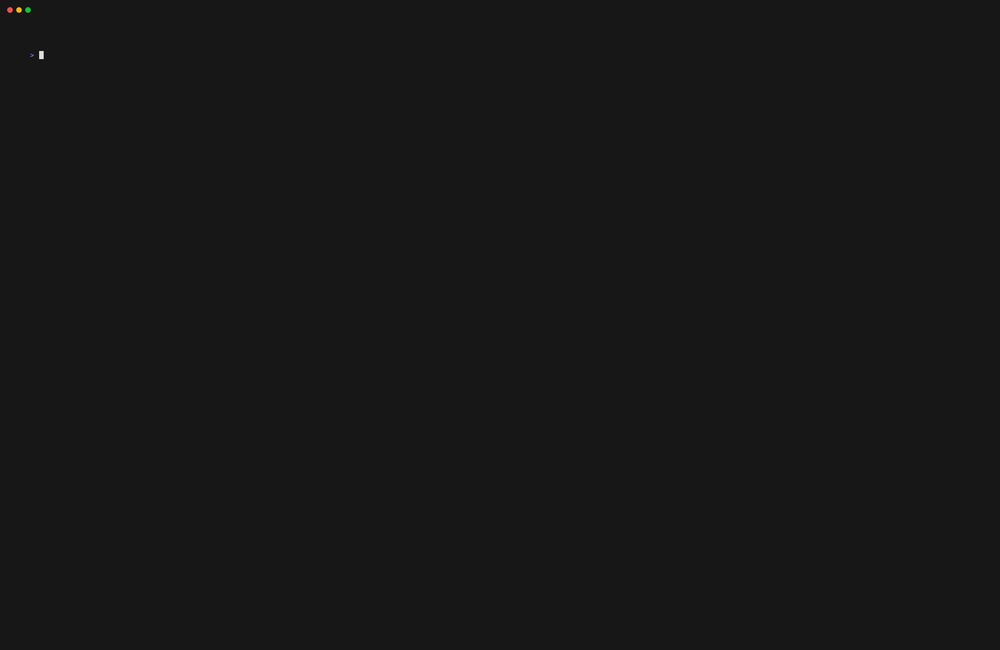
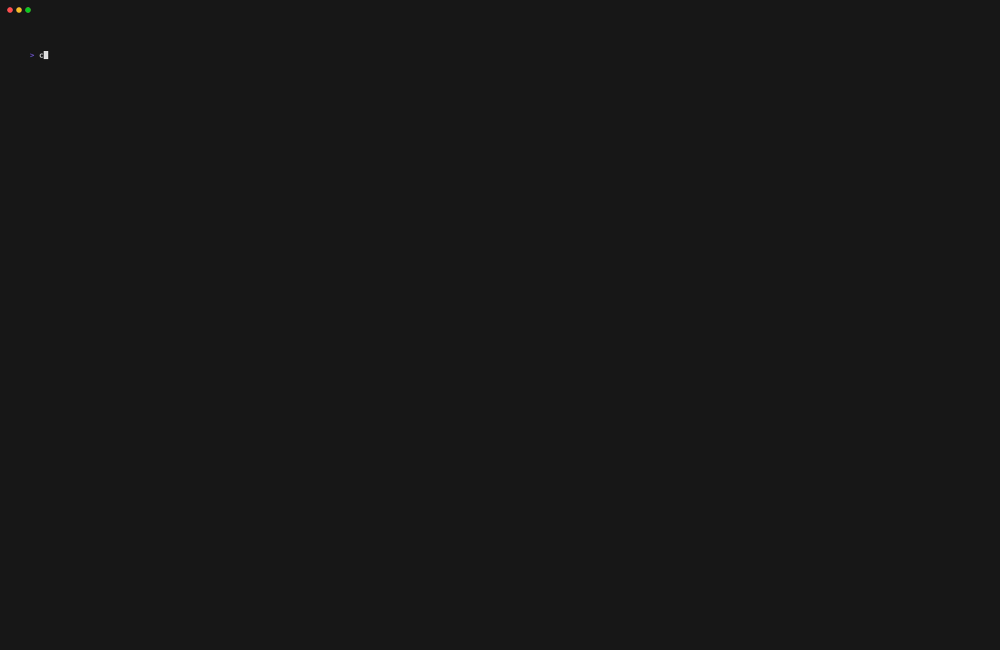
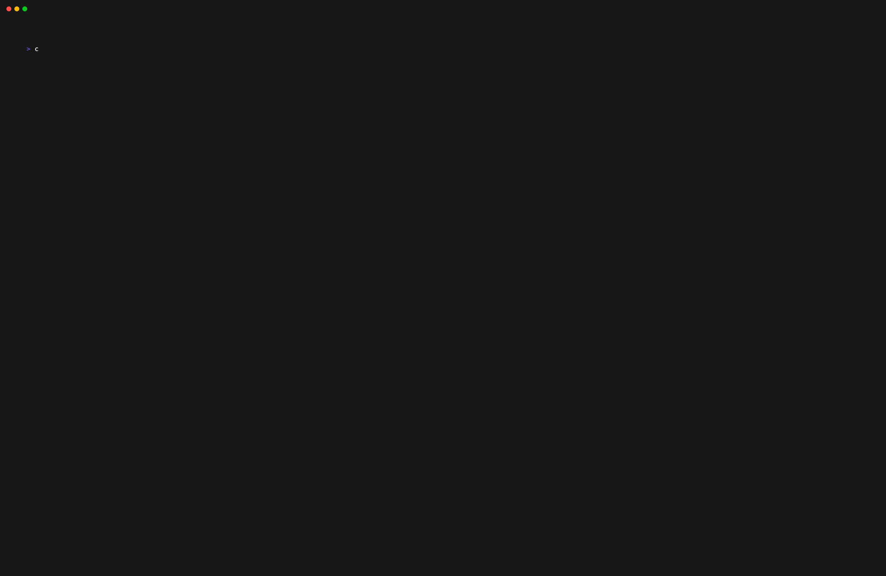

<div align="center">
<h1>chess-tui</h1>
Play chess from your terminal 🦀



<div>

     [](https://opensource.org/licenses/MIT) [](https://github.com/thomas-mauran/chess-tui/releases/latest)
  </div>
</div>

### Description

Chess-tui is a simple chess game you can play from your terminal. It supports local 2 players mode, online multiplayer, playing against any UCI compatible chess engine, Lichess integration, custom skins and more!

### Quick Install

**Homebrew:**
```bash
brew install thomas-mauran/tap/chess-tui
chess-tui
```

**Debian/Ubuntu:**
```bash
DEB_URL=$(curl -s "https://api.github.com/repos/thomas-mauran/chess-tui/releases/latest" | jq -r '.assets[] | select(.name | endswith(".deb")) | .browser_download_url') && curl -LO "$DEB_URL" && sudo dpkg -i "$(basename "$DEB_URL")" && sudo apt-get install -f
chess-tui
```

**Cargo:**
```bash
cargo install chess-tui
chess-tui
```

**Available on:** [](https://repology.org/project/chess-tui/versions)

For installation via package managers or other methods, see the [Installation Guide](https://thomas-mauran.github.io/chess-tui/docs/Installation/Packaging%20status).

### Features

<details>
  <summary>Local 2 player mode</summary>
  
</details>
<details>
  <summary>Play against any UCI chess engine</summary>
  
</details>
<details>
  <summary>Lichess Integration</summary>
  <p>Play online on Lichess directly from your terminal!</p>
  
  <p>See <a href="https://thomas-mauran.github.io/chess-tui/docs/Lichess/features">Lichess Features</a> for details.</p>
</details>
<details>
  <summary>Online multiplayer</summary>
  
</details>
<details>
  <summary>Helper menu</summary>
  
</details>

### Quick Start

**Connect a chess engine:**
```bash
# Simple engine path
chess-tui -e /path/to/engine

# Engine with command-line arguments (e.g., GNU Chess with UCI mode)
chess-tui -e "/opt/homebrew/bin/gnuchess --uci"

# Stockfish example
chess-tui -e /opt/homebrew/bin/stockfish
```
See [Bot Configuration](https://thomas-mauran.github.io/chess-tui/docs/Configuration/bot) for details.

**Configure Lichess:**
```bash
chess-tui -l YOUR_LICHESS_TOKEN_HERE
```
See [Lichess Setup](https://thomas-mauran.github.io/chess-tui/docs/Lichess/setup) for details.

### Documentation

📚 **[Full Documentation](https://thomas-mauran.github.io/chess-tui/docs/intro)**

- [Installation Guide](https://thomas-mauran.github.io/chess-tui/docs/Installation/Packaging%20status)
- [Configuration](https://thomas-mauran.github.io/chess-tui/docs/Configuration/configuration-intro)
- [Lichess Features](https://thomas-mauran.github.io/chess-tui/docs/Lichess/features)
- [Multiplayer Guide](https://thomas-mauran.github.io/chess-tui/docs/Multiplayer/Local%20multiplayer)

### Links

- 📦 [Crates.io](https://crates.io/crates/chess-tui)
- 🗺️ [Roadmap](https://github.com/users/thomas-mauran/projects/4)
- 🐛 [Report Issues](https://github.com/thomas-mauran/chess-tui/issues)
