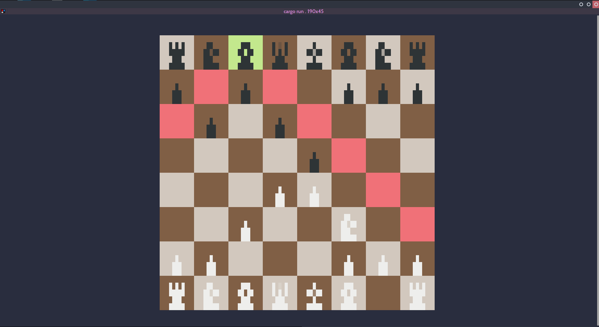

# chess-tui
A chess TUI implementation in rust



⚠️ THIS PROJECT IS STILL IN DEVELOPMENT ⚠️ 

### Roadmap

- ✅ Board render
- ✅ piece authorized moves
- Game logic 
- Win conditions
- Menu
- Last moves historic
- UCI compatibility

### How to run

**With Cargo**
```
git clone git@github.com:thomas-mauran/chess-tui.git
cd chess-tui
cargo build --release
./target/release/chess_tui
```