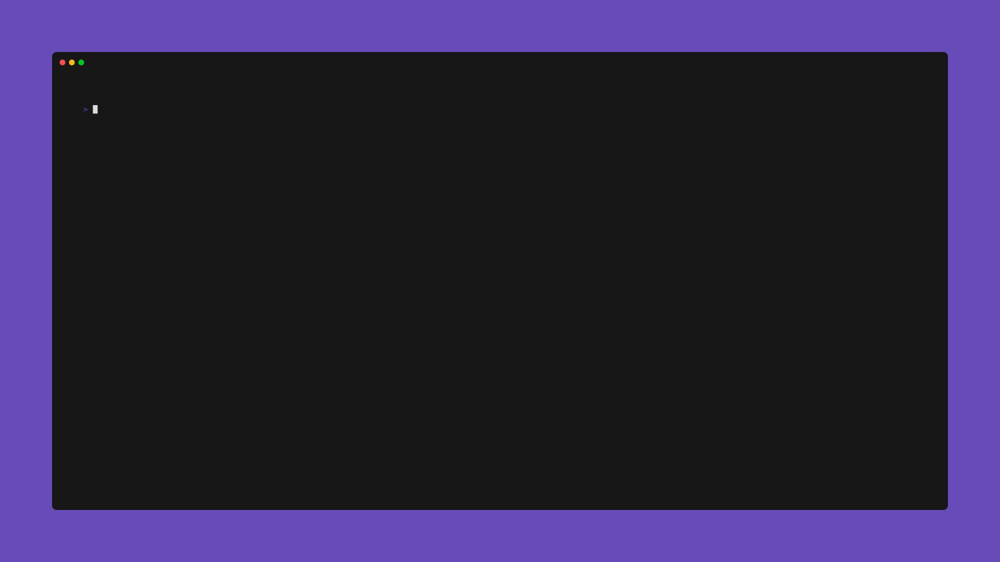
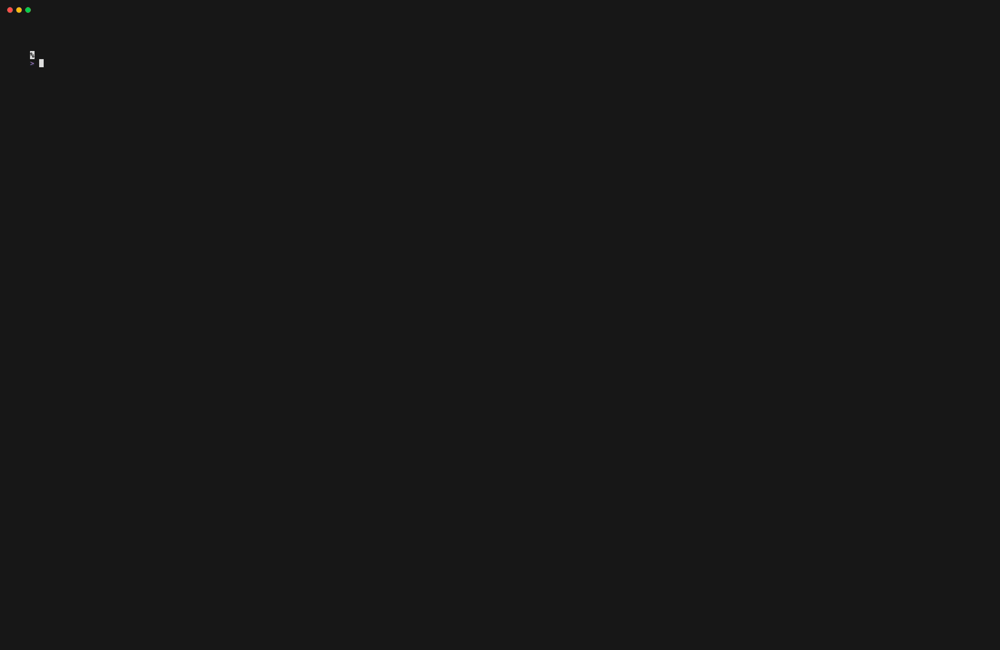

<div align="center">
<h1>chess-tui</h1>
A rusty chess game in your terminal 🦀


<div>

  [](https://opensource.org/licenses/MIT)[](https://github.com/thomas-mauran/chess-tui/releases/latest)
  </div>
</div>

### Description

Chess-tui is a simple chess game you can play from your terminal. It supports local 2 players mode, online multiplayer and playing against any UCI compatible chess engine.

### Quick install

```bash
cargo install chess-tui
chess-tui
```

If you want to install the game with your favorite package manager, you can find the installation guide [here](https://thomas-mauran.github.io/chess-tui/docs/Installation/Packaging%20status).

### Available on
[](https://repology.org/project/chess-tui/versions)

### Features

<details>
  <summary>Helper menu</summary>
  
</details>
<details>
  <summary>Local 2 player mode</summary>
  
</details>
<details>
  <summary>Online multiplayer</summary>
  
</details>
<details>
  <summary>Draws</summary>
  <ul>
  <li>Stalemate</li>
  <li>50 moves rules</li>
  <li>3 time repetition of the same position</li>
  </ul>
</details>
<details>
  <summary>Piece Promotion</summary>
  no demo available yet
</details>
<details>
  <summary>Play against any UCI chess engine as black or white</summary>
  <h3>Play the white pieces</h3>
  

  <h3>Play the black pieces</h3>
  
</details>

### Connect a chess engine

You can play chess-tui with any UCI compatible chess engines. To do so you will need to use the -e command to give the chess engine binary path.

Example:

```bash
chess-tui -e /your/bin/path
```

Here I installed stockfish using homebrew and gave chess-tui the path the the engine binary.
This command will store in your home directory the chess engine path so you don't have to relink it everytime !

### Configuration

Chess-tui uses a TOML configuration file located at `~/.config/chess-tui/config.toml`. Here are the available configuration options:

```toml
# Path to the chess engine binary
engine_path = "/path/to/engine"

# Display mode: "DEFAULT" or "ASCII"
display_mode = "DEFAULT"

# Logging level: "Off", "Error", "Warn", "Info", "Debug", "Trace"
log_level = "Off"
```

#### Configuration Options:

- **engine_path**: Path to your UCI-compatible chess engine binary
- **display_mode**:
  - `DEFAULT`: Uses unicode chess pieces
  - `ASCII`: Uses ASCII characters for pieces
- **log_level**: Controls the verbosity of logging
  - `Off`: No logging (default)
  - `Error`: Only errors
  - `Warn`: Warnings and errors
  - `Info`: General information, warnings and errors
  - `Debug`: Debugging information
  - `Trace`: Very verbose debugging information

The config file is automatically created when you first run chess-tui. You can manually edit it to customize your experience.

Base config:
```toml
# no engine path
display_mode = "DEFAULT"
log_level = "Off"
```

### Documentation

You can find the documentation of the project [here](https://thomas-mauran.github.io/chess-tui/docs/intro)

### Roadmap

You can find the roadmap of the project [here](https://github.com/users/thomas-mauran/projects/4) if you want to contribute.

### Crates.io

The project is also available on crates.io [here](https://crates.io/crates/chess-tui)
