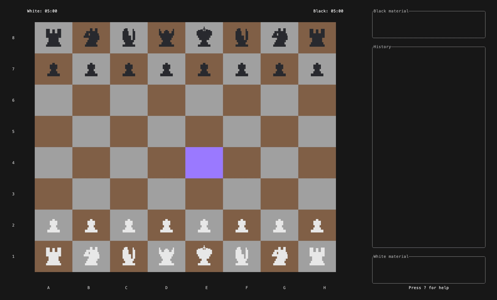
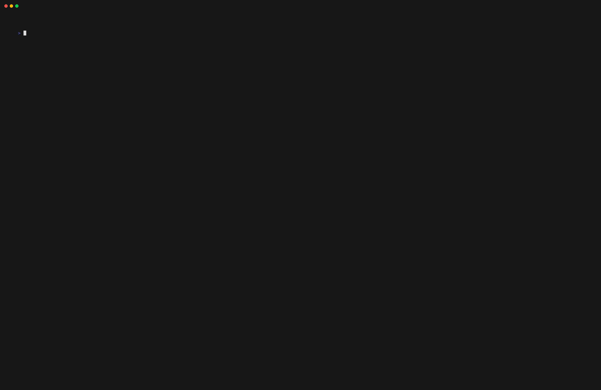
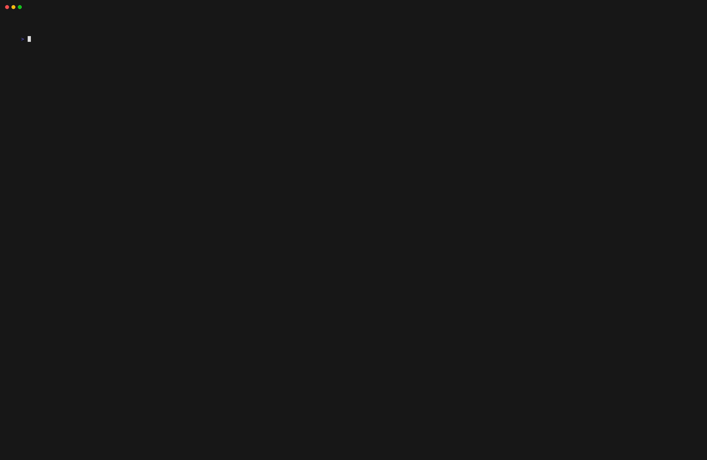
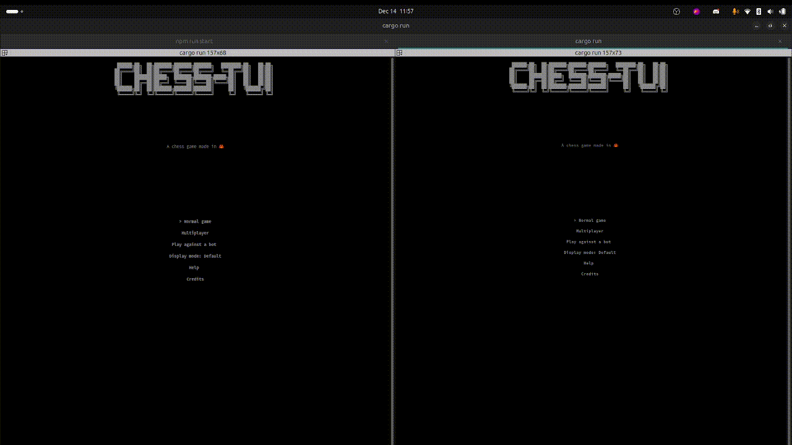

<div align="center">
<h1>chess-tui</h1>
<p><strong>Chess in the terminal.</strong> Free, cross-platform terminal chess game in Rust. Local play, Stockfish, Lichess. 🦀</p>



<div>

   [](https://opensource.org/licenses/MIT) [](https://github.com/thomas-mauran/chess-tui/releases/latest) [](https://ratatui.rs/)

  </div>
</div>

## Table of contents

- [Description](#description) · [Quick Install](#quick-install) · [Features](#features) · [Quick Start](#quick-start) · [Controls](#controls) · [Documentation](#documentation) · [Platforms](#platforms) · [FAQ](#faq) · [Contributing](#contributing)

### Description

**chess-tui** is a free, open-source **terminal chess** game. Play with a friend locally, against any **UCI chess engine** (e.g. **Stockfish**), or **online via Lichess**. Runs on **macOS, Linux, and Windows**.

### Quick Install

**Homebrew:**

```bash
brew install thomas-mauran/tap/chess-tui
chess-tui
```

**Cargo:**

```bash
cargo install chess-tui
chess-tui
```

**Debian/Ubuntu:**

```bash
DEB_URL=$(curl -s "https://api.github.com/repos/thomas-mauran/chess-tui/releases/latest" | jq -r '.assets[] | select(.name | endswith(".deb")) | .browser_download_url') && curl -LO "$DEB_URL" && sudo dpkg -i "$(basename "$DEB_URL")" && sudo apt-get install -f
chess-tui
```

**Available on:**

[](https://repology.org/project/chess-tui/versions)

For installation via package managers or other methods, see the [Installation Guide](https://thomas-mauran.github.io/chess-tui/docs/Installation/Packaging%20status).

### Features

<details>
  <summary>Local 2 player mode</summary>
  
</details>
<details>
  <summary>Play against any UCI chess engine</summary>
  
</details>
<details>
  <summary>Lichess Integration</summary>
  <p>Play online on Lichess directly from your terminal!</p>
  
  <p>See <a href="https://thomas-mauran.github.io/chess-tui/docs/Lichess/features">Lichess Features</a> for details.</p>
</details>
<details>
  <summary>Online multiplayer</summary>
  
</details>
<details>
  <summary>Helper menu</summary>
  
</details>
<details>
  <summary>Custom skins</summary>
  
</details>

### Quick Start

**Connect a chess engine:**

```bash
# Simple engine path
chess-tui -e /path/to/engine

# Engine with command-line arguments (e.g., GNU Chess with UCI mode)
chess-tui -e "/opt/homebrew/bin/gnuchess --uci"

# Stockfish example
chess-tui -e /opt/homebrew/bin/stockfish
```

See [Bot Configuration](https://thomas-mauran.github.io/chess-tui/docs/Configuration/bot) for details.

**Configure Lichess:**

```bash
chess-tui -l YOUR_LICHESS_TOKEN_HERE
```

See [Lichess Setup](https://thomas-mauran.github.io/chess-tui/docs/Lichess/setup) for details.

**Other options:** `--depth 15` (engine depth), `--difficulty easy|medium|hard|magnus`, `--no-sound`. See [Configuration](https://thomas-mauran.github.io/chess-tui/docs/Configuration/configuration-intro) for all flags and config file.

### Controls

| Key                           | Action                  |
| ----------------------------- | ----------------------- |
| **Arrow keys** or **h/j/k/l** | Move cursor             |
| **Space**                     | Select piece / move     |
| **Esc**                       | Deselect or close popup |
| **?**                         | Help menu               |
| **s**                         | Cycle skins             |
| **b**                         | Back to menu            |
| **q**                         | Quit                    |

Press **?** in-game for the full list.

### Documentation

📚 **[Full Documentation](https://thomas-mauran.github.io/chess-tui/docs/intro)** (installation, configuration, Lichess, multiplayer).

- [Installation](https://thomas-mauran.github.io/chess-tui/docs/Installation/Packaging%20status) (Cargo, Homebrew, Debian/Ubuntu, Arch, NixOS, Docker, binary)
- [Configuration](https://thomas-mauran.github.io/chess-tui/docs/Configuration/configuration-intro) (config file, skins, bot, logging)
- [Lichess](https://thomas-mauran.github.io/chess-tui/docs/Lichess/features) (seek game, join by code, ongoing games, puzzles)
- [Multiplayer](https://thomas-mauran.github.io/chess-tui/docs/Multiplayer/Online%20multiplayer) (LAN and over the internet, e.g. with [bore](https://github.com/ekzhang/bore))

### Platforms

| Platform    | Install                                                                                                                                                                 |
| ----------- | ----------------------------------------------------------------------------------------------------------------------------------------------------------------------- |
| **macOS**   | `brew install thomas-mauran/tap/chess-tui` or `cargo install chess-tui`                                                                                                 |
| **Linux**   | `cargo install chess-tui`, [.deb](https://github.com/thomas-mauran/chess-tui/releases), or [binary](https://thomas-mauran.github.io/chess-tui/docs/Installation/Binary) |
| **Arch**    | `pacman -S chess-tui`                                                                                                                                                   |
| **NixOS**   | `nix-shell -p chess-tui` or install from [nixpkgs](https://search.nixos.org/packages?query=chess-tui)                                                                   |
| **Windows** | `cargo install chess-tui`                                                                                                                                               |

### FAQ

- **Does it work with Stockfish?** Yes. Run `chess-tui -e /path/to/stockfish` (see [Bot Configuration](https://thomas-mauran.github.io/chess-tui/docs/Configuration/bot)).
- **Can I play on Lichess from the terminal?** Yes. Get a [Lichess API token](https://thomas-mauran.github.io/chess-tui/docs/Lichess/setup) and run `chess-tui -l YOUR_TOKEN`.
- **What is chess-tui built with?** [Rust](https://www.rust-lang.org/), [ratatui](https://github.com/ratatui-org/ratatui) (TUI), [shakmaty](https://crates.io/crates/shakmaty) (chess), [ruci](https://crates.io/crates/ruci) (UCI engine support).
- **Where is the config?** `config.toml` and `skins.json` in your config dir (e.g. `~/.config/chess-tui/` on Linux). See [Configuration](https://thomas-mauran.github.io/chess-tui/docs/Configuration/configuration-intro).

### Troubleshooting

Run into issues? Check the docs: [Lichess setup & troubleshooting](https://thomas-mauran.github.io/chess-tui/docs/Lichess/setup#troubleshooting), [Bot configuration & troubleshooting](https://thomas-mauran.github.io/chess-tui/docs/Configuration/bot#troubleshooting). Otherwise [open an issue](https://github.com/thomas-mauran/chess-tui/issues).

### Contributing

Contributions are welcome. See [CONTRIBUTING.md](CONTRIBUTING.md) for guidelines.

### Links

- 📦 [Crates.io](https://crates.io/crates/chess-tui)
- 📖 [Documentation](https://thomas-mauran.github.io/chess-tui/docs/intro)
- 📋 [Releases](https://github.com/thomas-mauran/chess-tui/releases) (changelog)
- 🗺️ [Roadmap](https://github.com/users/thomas-mauran/projects/4)
- 🐛 [Report Issues](https://github.com/thomas-mauran/chess-tui/issues)
- ⭐ Star the repo if you find it useful; it helps others find it.

---

_Terminal chess · Chess in the terminal · Chess CLI · Command line chess · Rust TUI · UCI engine · Lichess · Stockfish · ratatui_
