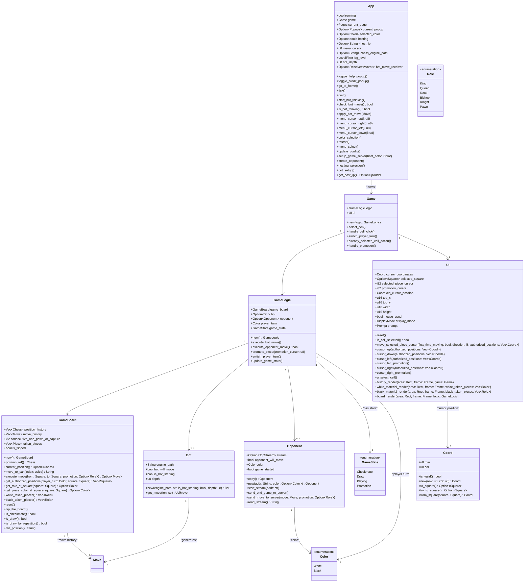

## Global architecture

## Architecture Overview

This class diagram provides a comprehensive overview of the chess-tui architecture and how different components interact.

## Core Components

### App

The `App` struct is the main application container that orchestrates the entire application. It manages application lifecycle, configuration, bot computation, and multiplayer setup.

[See App documentation for details →](./App.md)

### Game

The `Game` struct represents a chess game session. It has been refactored to separate concerns:
- **UI state** (`ui` field) - cursor position, selected pieces, display settings
- **Game logic** (`logic` field) - board state, move execution, game rules

This separation improves code maintainability and reduces borrow checker issues.

### GameLogic

The `GameLogic` struct encapsulates all game logic, separating it from UI concerns. It manages board state, move execution, bot/opponent handling, and game state tracking.

[See GameLogic documentation for details →](./GameLogic.md)

### GameBoard

The `GameBoard` struct manages the chess board state using the **shakmaty** chess library. It maintains position history, move history, and handles all chess rule validation.

[See GameBoard documentation for details →](./GameBoard.md)

### UI

The `UI` struct handles all rendering and user interaction. It manages cursor position, piece selection, and renders the board, move history, and captured pieces.

[See UI documentation for details →](./UI.md)

### Bot

The `Bot` struct interfaces with UCI-compatible chess engines using the **ruci** library. It manages the engine process and converts between FEN positions and UCI moves.

[See Bot documentation for details →](./Bot.md)

### Opponent

The `Opponent` struct handles online multiplayer via TCP streams. It manages network communication, move synchronization, and color assignment between players.

[See Opponent documentation for details →](./Opponent.md)

## Supporting Types

- **Coord**: Board coordinates (row, col) with safe conversion to/from shakmaty `Square`
- **Color**: Player color (White/Black) from shakmaty
- **Role**: Piece type (King, Queen, Rook, Bishop, Knight, Pawn) from shakmaty
- **GameState**: Current game state enum (Playing, Checkmate, Draw, Promotion)
- **Square**: Board square representation from shakmaty (a1-h8)
- **Move**: Chess move representation from shakmaty with promotion support
- **Chess**: Chess position type from shakmaty, maintains board state and legal moves

