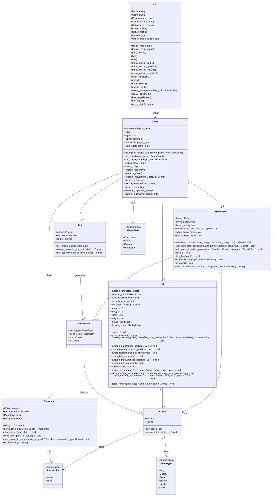

## Global architecture

This Class diagram allows us to have a quick overview of the game architecture and how the different struct interact.

### App

The App struct is the main struct of the game. It will be the one storing the game when we play it as well as the different pages we can navigate to.

### Game

The Game struct represent a new game. As variable a game stores a GameBoard, a UI, a Bot (if it's again a bot), the player turn and the game state.

### GameBoard

The GameBoard struct represent everything to the board, the table storing the pieces, the move history, the taken pieces, the consecutive non pawn or capture moves and the player turn.

### UI

The UI struct represent the user interface. It stores the cursor position, the selected piece, the promotion cursor, the old cursor position, the top left corner of the board, the width and height of the board, if the mouse is used and the display mode.
It also handles the rendering of the board, taken pieces and the rendering of the move history.