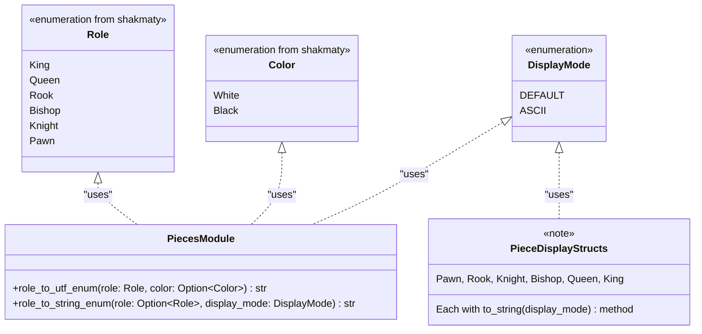

## Pieces Architecture

The pieces module in chess-tui is responsible for **rendering and display** of chess pieces. The actual chess logic (move validation, legal moves, game rules) is handled by the [`shakmaty`](https://docs.rs/shakmaty/) library.

## Architecture Overview



## Key Components

### Piece Representation

Chess pieces are represented using types from the **shakmaty** library:
- **`shakmaty::Role`** - Enum representing piece types (King, Queen, Rook, Bishop, Knight, Pawn)
- **`shakmaty::Color`** - Enum representing piece colors (White, Black)

The actual chess logic (legal moves, check detection, etc.) is handled by shakmaty's `Position` and `Chess` types in the `GameBoard` struct.

### Piece Display Structs

Each piece type has a simple struct with a `to_string()` method for rendering:

- **`Pawn`** - Renders pawn pieces
- **`Rook`** - Renders rook pieces  
- **`Knight`** - Renders knight pieces
- **`Bishop`** - Renders bishop pieces
- **`Queen`** - Renders queen pieces
- **`King`** - Renders king pieces

Each struct implements:
```rust
pub fn to_string(display_mode: &DisplayMode) -> &'static str
```

This method returns different visual representations based on the display mode:
- **DEFAULT mode**: Multi-line Unicode art using box-drawing characters
- **ASCII mode**: Single character representation (P, R, N, B, Q, K)

### Utility Functions

The `pieces` module provides utility functions for converting between shakmaty types and display strings:

#### `role_to_utf_enum(role: &Role, color: Option<Color>) -> &'static str`

Converts a shakmaty `Role` and optional `Color` to a UTF-8 chess piece symbol:
- White pieces: ♔ ♕ ♖ ♗ ♘ ♙
- Black pieces: ♚ ♛ ♜ ♝ ♞ ♟

Used for rendering pieces in the move history and captured pieces displays.

#### `role_to_string_enum(role: Option<Role>, display_mode: &DisplayMode) -> &'static str`

Converts a shakmaty `Role` to a string representation based on display mode:
- **DEFAULT**: Returns UTF-8 chess symbols (♚ ♛ ♜ ♝ ♞ ♟)
- **ASCII**: Returns single letters (K Q R B N P)

## Integration with Game Logic

The pieces module is **purely for display purposes**. All chess logic is handled by:

1. **`GameBoard`** - Uses `shakmaty::Chess` for position management
2. **`shakmaty::Position`** - Provides legal moves, check detection, etc.
3. **`shakmaty::Move`** - Represents moves in the game

When rendering the board, the UI layer:
1. Gets piece information from `GameBoard.get_role_at_square()` and `get_piece_color_at_square()`
2. Uses the pieces module utilities to convert to display strings
3. Renders using the appropriate display mode

## Example Usage

```rust
use shakmaty::{Role, Color};
use crate::pieces::{role_to_utf_enum, King};

// Get UTF symbol for a white king
let symbol = role_to_utf_enum(&Role::King, Some(Color::White)); // "♔"

// Get display string for king in ASCII mode
let ascii = King::to_string(&DisplayMode::ASCII); // "K"
```
