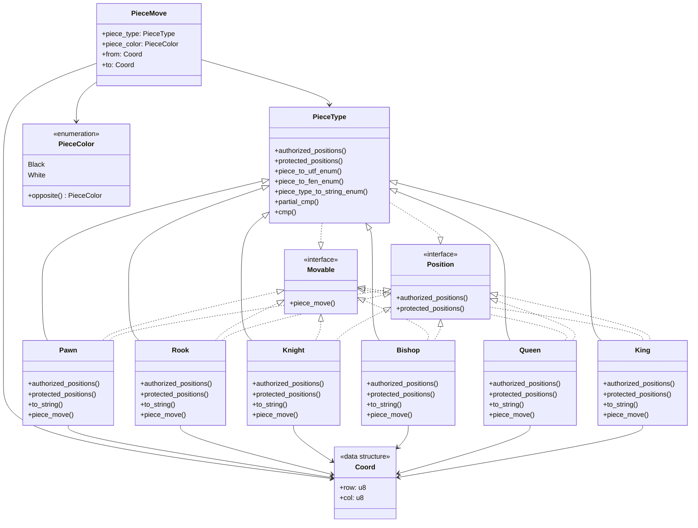

## Project architecture

Let's begin by looking at the pieces in the game.
## Class diagram

### Pieces

This schema can be a little bit overwhelming but let's break it apart.

#### PieceType

This class is basically the parent class of all the pieces. It contains the methods that are common to all the pieces. Such as authorized positions, protected positions, etc.

#### PieceColor

This is an enum that contains the two colors of the pieces. Black and White.

#### Pawn, Rook, Knight, Bishop, Queen, King

These are the classes that represent the pieces. They all inherit from PieceType and implement the methods that are specific to their type.

#### Movable and Position

These are rust traits that are implemented by the pieces. Movable is a trait that represents a piece that can move (piece_move method). Position is a trait that shows the authorized and protected positions of a piece.

#### Coord

This is a data structure that represents a position on the board. It contains a row and a column.

#### PieceMove

This is a data structure that represents a move of a piece. It contains the type of the piece, the color of the piece, the starting position, and the ending position. This is mainly used in the board structure that we will see later.

