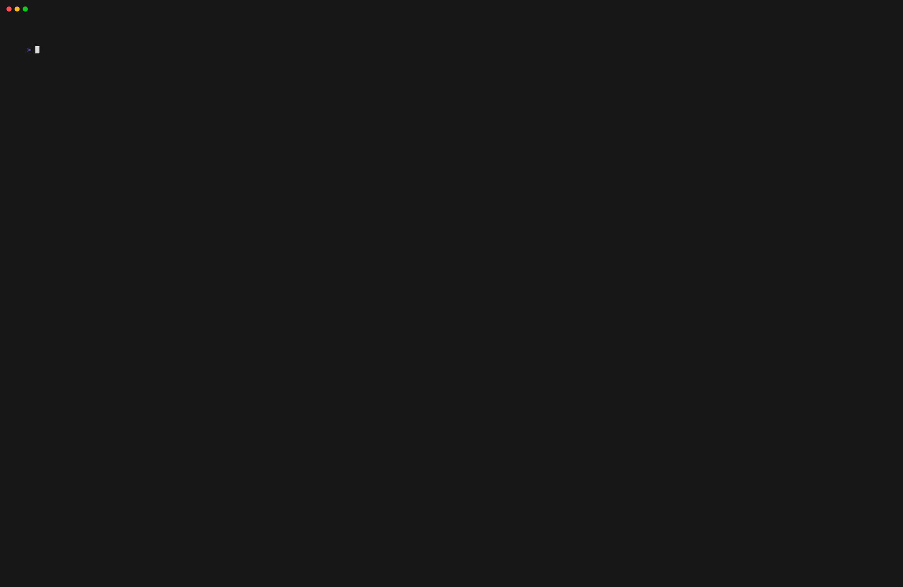

# Features

Once authenticated, you can access the Lichess menu from the main screen. Here are the available features:

## User Profile

Upon entering the Lichess menu, you will see your profile information on the right side of the screen, including:
*   **Username** and online status.
*   **Ratings** for different time controls (Blitz, Rapid, Classical, Bullet, Puzzle).
*   **Game Statistics**: Total games, wins, losses, and draws.
*   **Visual Charts**: A bar chart visualizing your win/loss/draw ratio or rating distribution.

## Play Online

### Seek a Game (Quick Pairing)
Select **Seek Game** to find an opponent for a correspondence game (3 days per move). The application will connect to Lichess and find a match for you. This is perfect for playing at your own pace without time pressure.

### Join by Code
If you have a specific game ID (e.g., from a friend or a tournament), you can use **Join by Code** to enter the game ID and join directly. When joining an ongoing game, the current board state and last move are displayed immediately, so you can see exactly where the game stands.

### Ongoing Games
The **My Ongoing Games** option lists all your currently active games on Lichess. Select one to jump right back into the action. This is perfect for correspondence games or reconnecting to a live game.

## Puzzles

Select **Puzzle** to play rated chess puzzles from Lichess.
*   **Solve**: Make moves on the board to solve the puzzle.
*   **Feedback**: You'll get immediate feedback on whether your move was correct or incorrect.
*   **Rating**: Your puzzle rating will update automatically after each puzzle.

## Technical Details: Polling System

Due to limitations in the Lichess API, `chess-tui` uses a polling system to ensure reliable move updates during games.

### Why Polling?

The Lichess streaming API can have random delays ranging from 3 to 60 seconds when delivering move updates. This makes it unreliable for real-time gameplay, especially in faster time controls. To work around this limitation, `chess-tui` implements a continuous polling system that:

*   **Polls every 3 seconds** to check for new moves and game state updates
*   **Polls continuously** even when it's your turn, to detect moves made on the Lichess website
*   **Uses the public stream endpoint** (`/api/stream/game/{id}`) to fetch the current game state with each poll
*   **Immediately displays the last move** when joining an ongoing game, so you see the current board state right away

### How It Works

1. When you join a game, a background polling thread starts automatically
2. The thread polls the Lichess API every 3 seconds to get the current game state
3. If it detects a new move (by comparing turn counts or the last move), it immediately updates the board
4. Polling continues throughout the game, even during your turn, to catch any moves made on the Lichess website
5. When joining an ongoing game, the current board state (FEN) and last move are fetched immediately for instant display

This ensures you see moves as quickly as possible (within 3 seconds) regardless of stream delays, and allows you to make moves both in `chess-tui` and on the Lichess website while staying synchronized.
