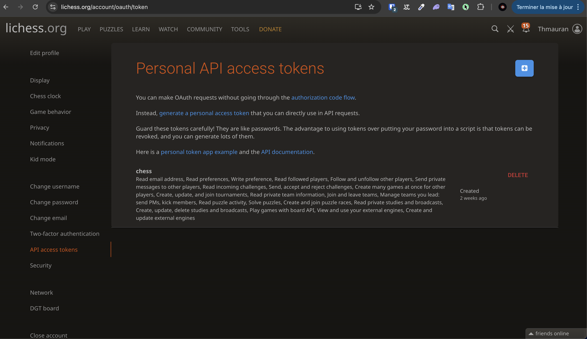
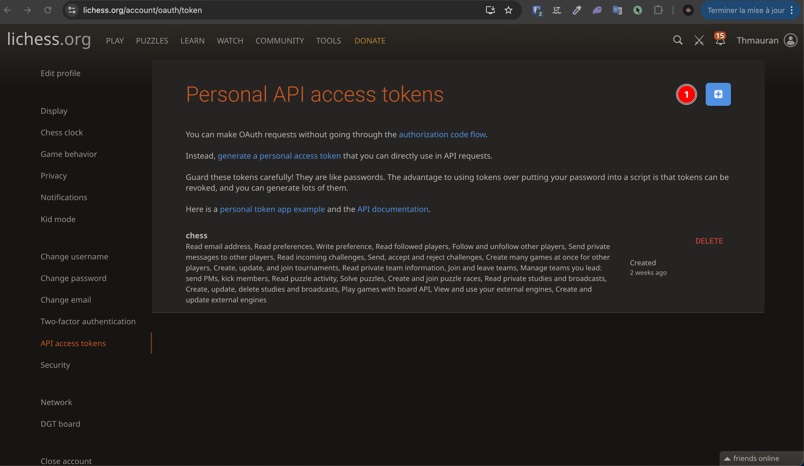
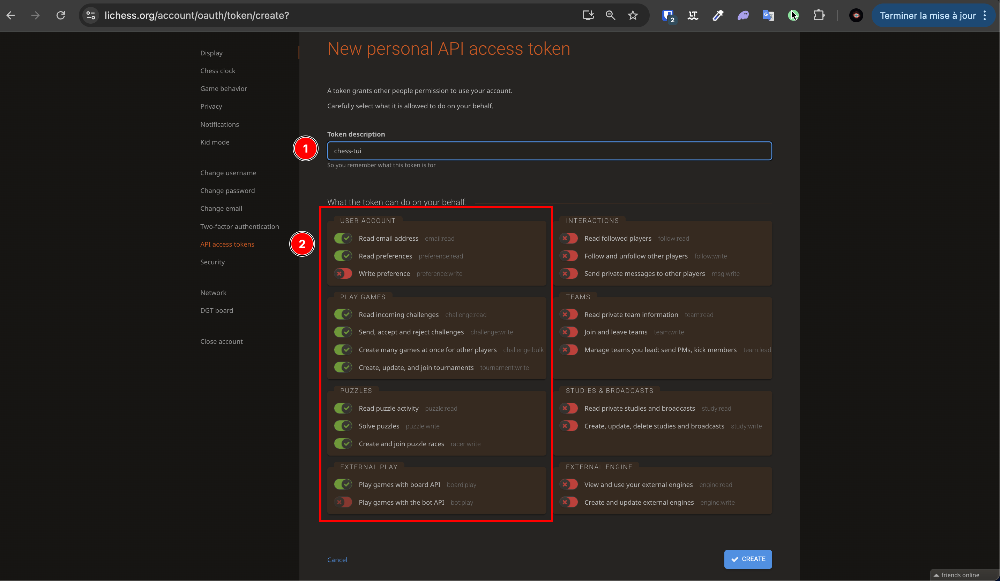
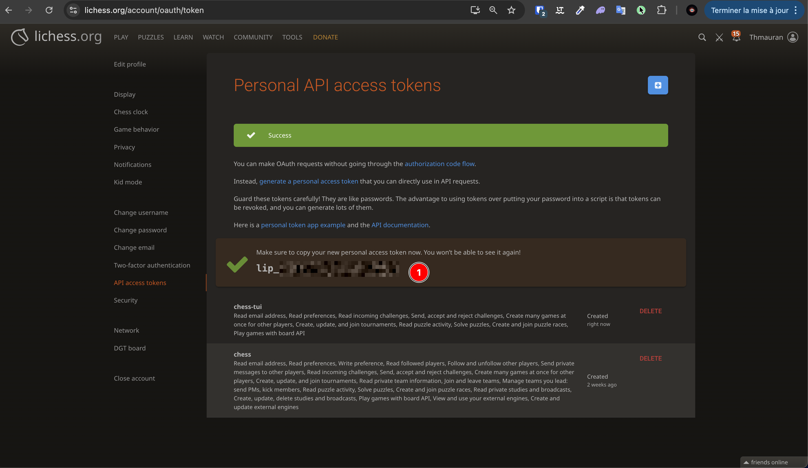
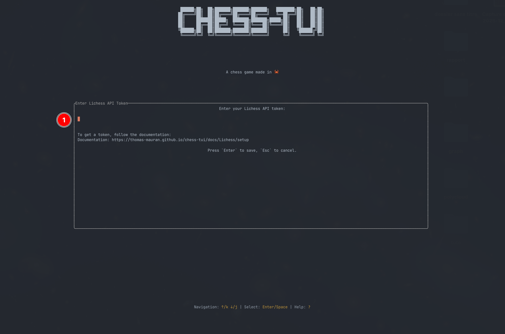

# Setup & Authentication

To use the Lichess integration features in `chess-tui`, you need to authenticate with a Lichess API token. This guide will walk you through the process step by step.

## Generating a Token

First, you need to generate a personal access token from your Lichess account.

### Step 1: Navigate to Lichess Token Page

1. Go to your [Lichess Account Security](https://lichess.org/account/oauth/token) page.
2. You should see a page with options to manage your API tokens.



### Step 2: Generate a New Token

1. Click on **"Generate a personal access token"** button.
2. A form will appear asking for token details.



### Step 3: Configure Token Settings

1. Give your token a description (e.g., "chess-tui" or "Chess TUI Application").
2. **Important:** Make sure to check **all the scopes (permissions)** to ensure full functionality. At a minimum, you need:
   - `Read preferences`
   - `Create, read, update, delete games` (or `board:play`)
   - `Read puzzle activity` (or `puzzle:read`)



### Step 4: Copy Your Token

1. Click **"Submit"** to create the token.
2. **Important:** Copy your token immediately - you won't be able to see it again!
3. The token will look like a long string of characters.



:::warning
Keep your token secure! Never share it publicly. If you lose it, you'll need to generate a new one.
:::

## Configuring the Token in chess-tui

There are three ways to provide your token to `chess-tui`. We recommend the **Interactive Entry** method for the best user experience.

### Method 1: Interactive Entry (Recommended) ⭐

This is the easiest method and requires no technical knowledge. When you try to access Lichess features without a token, `chess-tui` will automatically guide you through the process.

#### Step 1: Access Lichess Features

1. Launch `chess-tui`.
2. Navigate to the main menu.
3. Select **"Lichess"** from the menu options.


#### Step 2: Token Entry Popup Appears

If you don't have a token configured, a popup will automatically appear asking you to enter your token.



#### Step 3: Enter Your Token

1. Paste your Lichess API token into the input field.
2. The token will be masked for security (only the last 4 characters are visible).
3. Press `Enter` to save and validate the token.


#### Step 4: Token Validation

The application will automatically:
- Validate your token by connecting to Lichess
- Save it to your configuration file
- Display a success message with your username

If the token is invalid, you'll see an error message with helpful instructions.

#### Step 5: Start Using Lichess Features

Once your token is saved, you'll be automatically taken to the Lichess menu where you can:
- Seek games
- Solve puzzles
- View ongoing games
- Join games by code


### Method 2: Command Line Argument

If you prefer to set the token when launching the application, you can use the command line flag.

```bash
chess-tui -l YOUR_LICHESS_TOKEN_HERE
```

Or with the long form:

```bash
chess-tui --lichess-token YOUR_LICHESS_TOKEN_HERE
```

The token will be automatically saved to your configuration file for future use, so you only need to do this once.

### Method 3: Configuration File (Advanced)

For advanced users who prefer manual configuration, you can edit the configuration file directly.

#### Locate Your Config File

The configuration file is located at `CONFIG_HOME/chess-tui/config.toml`, where `CONFIG_HOME` is:

- **Linux**: `$XDG_CONFIG_HOME` or `$HOME/.config`
- **macOS**: `$HOME/Library/Application Support`
- **Windows**: `%APPDATA%` (Roaming AppData folder)

#### Edit the Configuration

Open the `config.toml` file and add your token:

```toml
lichess_token = "YOUR_LICHESS_TOKEN_HERE"
```

If the file doesn't exist, create it with this content. Make sure to replace `YOUR_LICHESS_TOKEN_HERE` with your actual token.

## Verifying Your Setup

Once you've configured your token, you can verify it's working:

1. Launch `chess-tui`.
2. Navigate to the **"Lichess"** menu option.
3. If your token is valid, you'll see the Lichess menu with your username displayed.

## Troubleshooting

### Token Not Working
If you're having issues with your token:

1. **Check token validity**: Make sure you copied the entire token correctly.
2. **Verify scopes**: Ensure all required scopes are enabled in your Lichess token settings.
3. **Generate a new token**: If the token still doesn't work, try generating a new one.
4. **Check error messages**: The application will display specific error messages to help diagnose the issue.

### Common Error Messages

- **"Invalid token"**: Your token may be incorrect or expired. Generate a new one.
- **"Token missing permissions"**: Make sure you enabled all required scopes when generating the token.
- **"Failed to fetch profile"**: Check your internet connection and try again.

### Need Help?

If you continue to experience issues:
1. Check the [Lichess API documentation](https://lichess.org/api#tag/authentication)
2. Verify your token at the [Lichess token page](https://lichess.org/account/oauth/token)
3. Try generating a new token with all scopes enabled

## Next Steps

Now that you've set up your Lichess token, you can:
- [Learn about Lichess features](./features.md)
- Start playing games online
- Solve puzzles
- Join games with friends

Enjoy playing chess with `chess-tui`!
