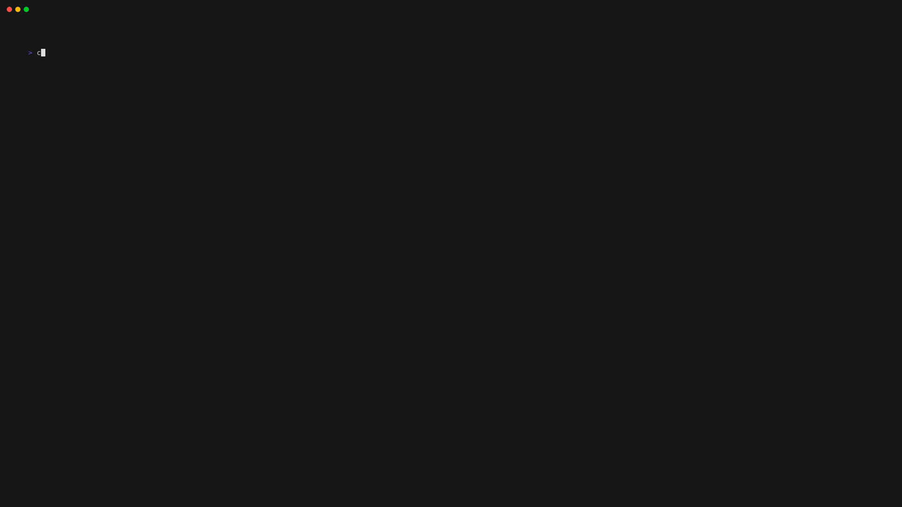

# Local Multiplayer

The local multiplayer feature is available in the `Normal game` menu option. You can play chess with your friends on the same computer using this feature.

Each turn the board will turn allowing your opponent to play. The game will continue until one of the players wins or the game ends in a draw.

