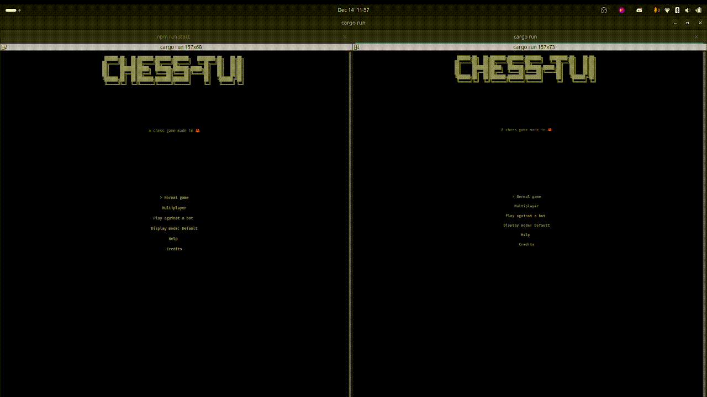
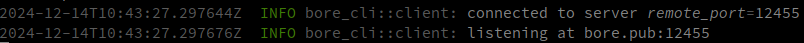
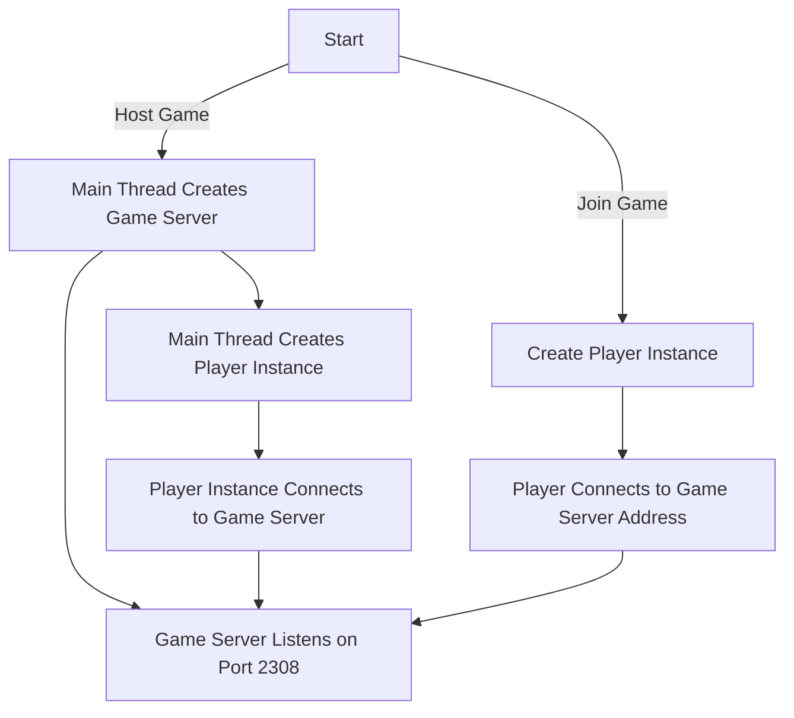

# Online Multiplayer

You can now play chess with your friends online. The online multiplayer feature is available in the `Multiplayer` menu option.




## LAN

If you are on the same network as your friend you don't have anything to worry about. One of the player need to choose `Host` and the other player need to choose `Join`. The player who is hosting the game will get it's ip displayed on the screen. The other player need to enter the `ip`:2308 and click on `Join`.

By default the game will be hosted on port 2308, make sure you had :2308 at the end of the ip address.

## WLAN

If you are not on the same network as your friend you need to do some port forwarding, but don't worry tools allows you to do that in one command !

For this we will use [Bore](https://github.com/ekzhang/bore) which is an open source rust written tool that allows you to expose your local server to the internet.

First you need to install bore, you can do that by running the following command:

```bash
cargo install bore
```

Then you need to create a tcp tunnel to your local server, you can do that by running the following command:

```bash
bore local 2308 --to bore.pub
```

this will create a tunnel to your local server on port 2308 to bore.pub, once done you will see the following message:


This means that you can access the game on bore.pub:12455 (the port will obviously be different).

The other player then only need to enter bore.pub:port_given to join the game.

Here for example it would be `bore.pub:12455`

### How does it work ?

When you host a game a new thread will be created running a game_server instance that will listen on the port 2308. This Game Server will handle 2 clients at max and will simply forward the messages between the 2 clients. In the meantime the main thread creates a new Player instance which represent a connection to the game server.

If you are joining a game you are not creating a game server but simply creating a Player instance that will connect to the game server address.



### Message exchange

The message exchange between the clients and the server is done using a simple protocol with the following terms:

- `b` : Player will play with black pieces
- `w` : Player will play with white pieces
- `s` : The game has started
- `ended` : The game has ended
- `e4e5` : A move from e4 to e5
- `e6e7q` : A move from e6 to e7 with a promotion to queen

When we are hosting we choose a color and then wait for the `s` message to be sent to start the game. When we are joining we wait for the color `b` or `w` message then for the `s` message to start the game.

When the game is started the server will send the `s` message to both clients and the game will start. The clients will then send the moves to the server and the server will forward the moves to the other client.

When the game ends the server will send the `ended` message to both clients and the game will be over.
