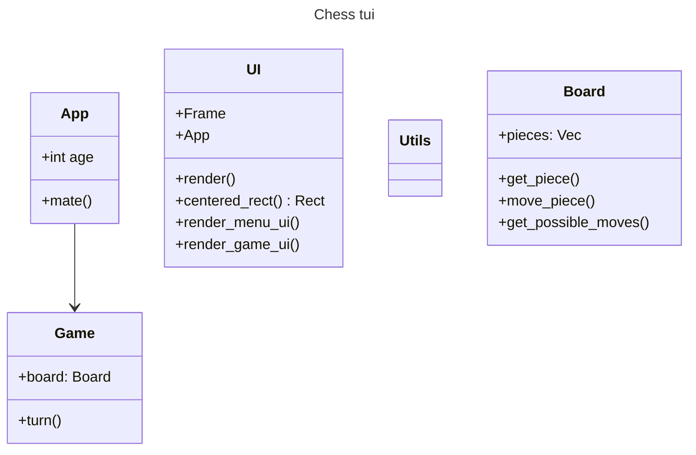
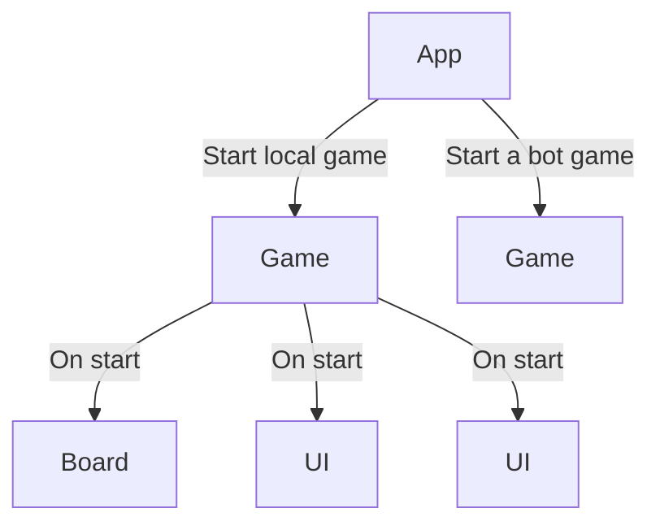

# Project architecture

## Class diagram

```mermaid
graph TD;
    A-->B;
    A-->C;
    B-->D;
    C-->D;
```

### Game itself

```mermaid
---
title: Chess tui
---
classDiagram
    App --> Game
    App : +int age
    App: +mate()


    

    

    class Game{
        +board: Board
        +turn()

    }

    class UI {
        +Frame
        +App

        +render()
        +centered_rect() Rect
        +render_menu_ui()
        +render_game_ui()
    }

    class Utils{
    }

    class Utils{
    }


    class Board{
        +pieces: Vec<Piece>
        +get_piece()
        +move_piece()
        +get_possible_moves()
    }
```

## Overview

```mermaid
graph TD
    A[App] -- Start local game --> B[Game]
    A -- Start a bot game --> C[Game]
    B -- On start --> D[Board]
    B -- On start --> E[UI]
    B -- On start --> F[UI]
```

